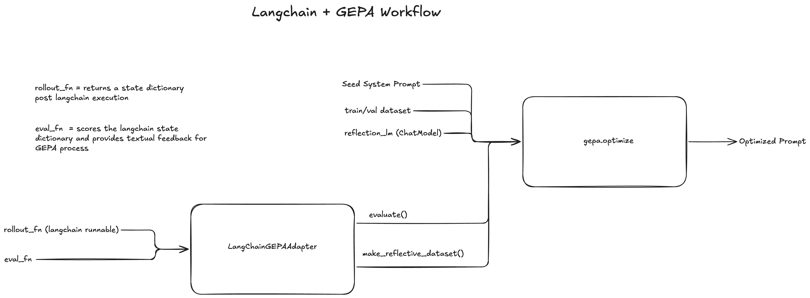

# langchain-gepa-adapter

GEPA adapter for LangChain v1. Optimize the prompts (and other text components) of any LangChain pipeline — a single chat model, an agent built with `langchain.agents.create_agent`, a custom LangGraph graph, RAG, etc. — using the [GEPA](https://github.com/gepa-ai/gepa) reflective evolutionary optimizer.

## Install

```bash
pip install langchain-gepa-adapter
# or, from a clone:
uv sync                   # core only
uv sync --extra examples  # adds datasets, dotenv, etc. for the example scripts
```

## Quickstart

Two things are required

- **`rollout_fn(candidate, example) -> state`** — create a langgraph state, runs the candidate prompt with the example and returns the generates a final state object 
- **`eval_fn(example, state) -> (score, feedback)`** — scores the rollout. The feedback string is what GEPA's reflection LM reads when proposing improvements

```python
from gepa import optimize
from langchain.chat_models import init_chat_model
from langchain_core.messages import AIMessage, HumanMessage, SystemMessage

from langchain_gepa_adapter import (
    LangChainGEPAAdapter,
    last_message_text,
    make_default_proposer,
    make_reflection_lm,
)

task_llm = init_chat_model("openai:gpt-4o-mini")
reflection_llm = init_chat_model("openai:gpt-5-mini")

def rollout(candidate, example):
    messages = [
        SystemMessage(candidate["system_prompt"]),
        HumanMessage(example["input"]),
    ]
    result = task_llm.invoke(messages)
    if not isinstance(result, AIMessage):
        result = AIMessage(content=str(result.content))
    return {"messages": messages + [result]}

def evaluate(example, state):
    response = last_message_text(state)
    if example["answer"] in response:
        return 1.0, "Correct."
    return 0.0, f"Wrong. Expected {example['answer']}."

reflection = make_reflection_lm(reflection_llm)
adapter = LangChainGEPAAdapter(
    rollout_fn=rollout,
    eval_fn=evaluate,
    custom_proposer=make_default_proposer(reflection),
)

result = optimize(
    seed_candidate={"system_prompt": "Answer the question."},
    trainset=train_set,
    valset=val_set,
    adapter=adapter,
    reflection_lm=reflection,
    max_metric_calls=500,
)
print(result.best_candidate["system_prompt"])
```



## Agents and tools

`rollout_fn` returns a state dict, so any LangGraph state — including agents built with `create_agent` — is supported directly:

```python
from langchain.agents import create_agent
from langchain_core.tools import tool

@tool
def calculator(a: int, b: int, op: str) -> str:
    ...

def rollout(candidate, example):
    agent = create_agent(
        model=task_llm,
        tools=[calculator],
        system_prompt=candidate["system_prompt"],
    )
    return agent.invoke({"messages": [HumanMessage(example["input"])]})
```

`evaluate` can then walk `state["messages"]` to inspect tool calls, not just the final response.


## Prompt Optimization Examples


| Script | Task | command |
|---|---|---|
| [`examples/pair_sum_product.py`](examples/pair_sum_product.py) | Single Turn LLM prompt optimization with a synthetic problem | `uv run python examples/pair_sum_product.py`|
| [`examples/big_number_arithmetic.py`](examples/big_number_arithmetic.py) | Multi-digit arithmetic with a calculator tool-using agent. Uses `create_agent` | `uv run python examples/big_number_arithmetic.py` |
| [`examples/aime.py`](examples/aime.py) | AIME competition math from HuggingFace `datasets` |  `uv run python examples/aime.py`|
| [`examples/gsm8k.py`](examples/gsm8k.py) | GSM8K grade-school word problems from HuggingFace `datasets` | `uv run python examples/gsm8k.py`|

```bash

uv run python examples/big_number_arithmetic.py

# Private LLM params via JSON
uv run python examples/big_number_arithmetic.py \
  --task-model-config llm_configs/gpt-5-mini.json \
  --reflection-model-config llm_configs/gpt-5.json
```

## Model configs

The example scripts default to standard LangChain model strings (`openai:gpt-4o-mini`, etc.). For custom LLMs, write your `init_chat_model` kwargs to a JSON file and pass `--task-model-config <path>`:

```json
{
  "model": "gpt-5-mini",
  "model_provider": "openai",
  "base_url": "https://your-gateway.example.com/openai/gpt-5-mini",
  "api_key": "...",
  "default_headers": {"custom-header-key": "xyz"}
}
```

`load_chat_model("openai:gpt-5-mini", config_path="path.json")` loads the JSON when given, otherwise falls back to the model string. Keep the JSON files outside source control — `llm_configs/` is already gitignored.


